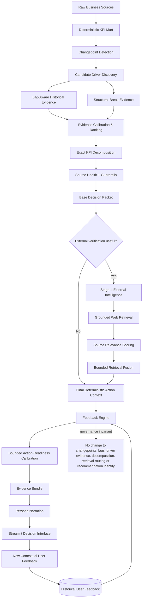
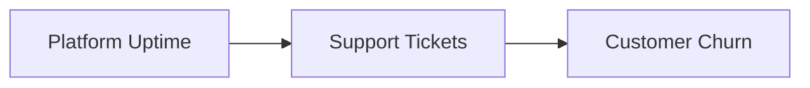
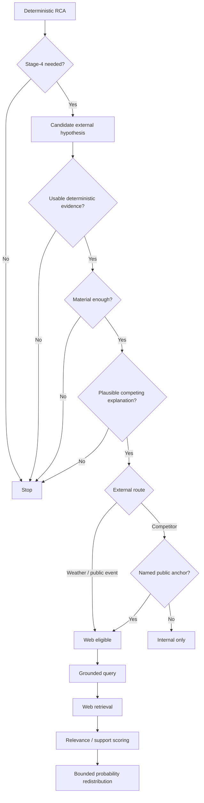
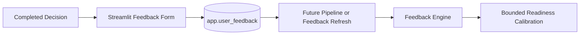

# Aletheia

> **Governed Decision Intelligence for Business KPI Root-Cause Analysis**

Aletheia is an explainable business decision-intelligence system that detects meaningful KPI shifts, decomposes those shifts into business components, evaluates plausible drivers using temporally safe statistical evidence, applies source-health and uncertainty guardrails, selectively invokes external intelligence only when it can meaningfully discriminate between already-supported hypotheses, and uses historical user feedback as a bounded downstream calibration of action readiness without rewriting deterministic RCA evidence.

The core design principle is simple:

> **LLMs and external retrieval may enrich interpretation, but they must never overwrite deterministic business evidence.**


**Repository:** [github.com/rtcpc/aletheia](https://github.com/rtcpcx/aletheia)  
**Issues:** [GitHub Issues](https://github.com/rtcpcx/aletheia/issues)

## Table of contents

- [What problem does Aletheia solve?](#what-problem-does-aletheia-solve)
- [Architecture](#architecture)
- [Core analytical flow](#core-analytical-flow)
- [Analytical methodology](#1-kpi-contracts)
- [Governed feedback calibration](#14-governed-feedback-calibration)
- [Benchmark](#benchmark)
- [Current validated development benchmark](#current-validated-development-benchmark)
- [Repository structure](#repository-structure)
- [Technology stack](#technology-stack)
- [Requirements](#requirements)
- [Installation](#installation)
- [Configuration](#configuration)
- [Generate benchmark data](#generate-benchmark-data)
- [Initialize MySQL](#initialize-mysql)
- [Run the pipeline](#run-the-pipeline)
- [Run evaluation](#run-evaluation)
- [Launch the application](#launch-the-application)
- [Feedback](#feedback)
- [Feedback demonstration](#feedback-demonstration)
- [Governance principles](#governance-principles)
- [Troubleshooting and FAQ](#troubleshooting-and-faq)
- [Development utilities](#development-utilities)
- [Status](#status)
- [Disclaimer](#disclaimer)

---

## What problem does Aletheia solve?

Traditional dashboards answer:

> **What changed?**

Aletheia is designed to go further:

> **Why did it change?**  
> **How confident are we?**  
> **What should the business investigate or do next?**

Example questions:

- Revenue declined — was the impact driven by lower average selling price or fewer units sold?
- Units fell — was stock availability the operational bottleneck?
- Churn increased — were support tickets the direct mechanism while uptime was the upstream trigger?
- A KPI changed during severe weather — is the external event actually supported by internal business evidence?
- A source became stale — should the system abstain rather than issue a business recommendation?

Aletheia turns these questions into a governed, auditable RCA pipeline.

---

## Architecture



The feedback loop is intentionally **downstream-only**. Deterministic business evidence determines the explanation and recommendation; historical feedback can only calibrate the separate operational-readiness score attached to that decision.

---

## Core analytical flow

```mermaid
flowchart LR
    A[KPI Contract] --> B[Detect KPI shift]
    B --> C[Discover allowed drivers]
    C --> D[Select lag on historical-only data]
    D --> E[Evaluate incident activation]
    E --> F[Rank deterministic evidence]
    F --> G[Decompose KPI change]
    G --> H[Apply source-health guardrails]
    H --> I[Build base decision]
    I --> J[Optional Stage-4 verification]
    J --> K[Build final deterministic action context]
    K --> L[Load eligible historical feedback]
    L --> M[Bounded readiness calibration]
    M --> N[Evidence bundle + narration]
```



Feedback is never used to discover a driver, select a lag, fit a model, change decomposition, authorize web retrieval, or manufacture an action.

---

## 1. KPI contracts

Business logic is declared in `config/kpi_contracts.yaml`.

Each KPI contract defines:

- KPI decomposition
- valid drivers
- maximum lag
- source cadence
- expected effect direction
- causal role
- mediator relationships
- component mapping

This prevents Aletheia from searching arbitrary correlations and forces analysis to remain business-ontology aware.

---

## 2. Changepoint detection

Aletheia identifies structural KPI shifts rather than treating every daily fluctuation as an incident.

Primary implementation: `src/signal_engine.py`

Changepoints act as the entry point for downstream RCA.

---

## 3. Driver discovery

For every detected KPI shift, Aletheia evaluates only drivers declared in the corresponding KPI contract.

Implementation: `src/driver_discovery.py`

Lag selection is performed on historical-only data to prevent temporal leakage. Future incident observations are never used to choose the lag.

---

## 4. Cadence-aware lag semantics

Not every source has daily information.

Typical source cadence:

```text
sales                 daily
marketing             daily
customer success      daily
market context        weekly
```

Aletheia therefore avoids false precision for coarse sources. A weekly source is interpreted at source-period resolution instead of being treated as an exact daily causal signal.

Example:

```text
Observed lag: 1 source period
Resolution: approximately 7 days
```

---

## 5. Evidence engine

Aletheia supports multiple deterministic evidence regimes.

### Historical relationship

Used when sufficient historical variation exists. Evidence considers historical coefficient, incident movement, coefficient stability, lag alignment, and expected business-effect direction.

### Structural break

Used when a driver has little historical variation but changes sharply during the incident. This prevents operational failures such as inventory availability collapsing from being discarded simply because the variable was historically stable.

### Insufficient evidence

When neither evidence regime is defensible, the system explicitly abstains.

Implementation: `src/evidence_engine.py`

---

## 6. Causal-chain semantics

Aletheia distinguishes between direct mechanism, upstream trigger, and mediator.



Interpretation:

```text
Platform uptime = upstream trigger
Support tickets = direct / actionable mechanism
```

This allows the system to explain the upstream trigger while keeping the operational action targeted at the nearer mechanism.

---

## 7. Exact KPI decomposition

Aletheia decomposes KPI changes before assigning driver explanations.

Example:

```text
Revenue = Units Sold × Average Selling Price
```

Revenue change is decomposed into unit effect, price effect, and interaction effect rather than being treated as an indivisible metric.

For ratio KPIs, exact symmetric decomposition is used instead of a first-order approximation.

Implementation: `src/decomposition_engine.py`

---

## 8. Source-health guardrails

Before issuing a business recommendation, Aletheia checks whether required source feeds were healthy at the time of the incident.

Checks include source availability, freshness, completeness, observed ingestion lag, and declared source status.

Example:

```text
Marketing source
Observed lag: 78 hours
Completeness: 0%
Status: stale
```

Result:

```text
Confidence -> Low
Business action -> blocked
```

This helps distinguish data-quality failures from genuine business shifts.

Implementation: `src/guardrails_engine.py`

---

## 9. Decision and action engine

Aletheia separates evidence confidence from action readiness.

Possible action states include:

```text
act
validate
validate_unexplained
monitor
data_quality_first
```

The system also separates the strongest analytical explanation from the most appropriate operational action target.

Implementation: `src/action_engine.py`

---

## 10. Stage-4 external intelligence

External retrieval is strictly downstream of deterministic RCA.

It cannot modify raw business data, KPI mart data, detected changepoints, selected lags, fitted coefficients, or deterministic evidence creation.

Stage 4 may only assess an already-existing externally resolvable hypothesis.



---

## 11. Retrieval precision

Being externally searchable does not automatically justify a web search.

A public hypothesis must have:

1. usable deterministic evidence;
2. plausible incident direction;
3. material within-component support;
4. meaningful absolute evidence;
5. another plausible competing hypothesis.

A conditional competitor hypothesis additionally requires a concrete public anchor such as a named competitor.

---

## 12. Bounded evidence fusion

External information may only redistribute probability mass among hypotheses that already exist.

If effective external support is zero:

```text
probability_after = probability_before
```

Retrieval therefore cannot manufacture evidence.

Implementation: `src/evidence_fusion.py`

---

## 13. Narration

The final evidence bundle is converted into business-readable narratives.

The narration layer is evidence-bounded. The LLM does not invent new drivers, new causal mechanisms, coefficients, evidence scores, or recommendations unsupported by the action layer.

Implementation: `src/narrator.py`

---

## 14. Governed feedback calibration

Aletheia includes an implemented feedback engine in `src/feedback_engine.py`.

The purpose of this layer is **not** to teach the RCA engine which explanation users prefer. Instead, it uses prior user experience to make the operational-readiness signal slightly more or less conservative while leaving analytical facts unchanged.

### Matching logic

Historical feedback is eligible when it matches the current:

```text
KPI
primary driver
action level
```

Same-region feedback receives full weight:

```text
weight = 1.0
```

Comparable feedback from another region receives reduced weight:

```text
weight = 0.5
```

This allows cautious transfer across regions without treating all operational contexts as identical.

### Disposition mapping

```text
Helpful      = +1
Unclear      =  0
Not helpful  = -1
```

The reliability term shrinks small samples toward a no-op:

```text
reliability = effective_sample_size / (effective_sample_size + 5)
```

The final feedback adjustment is bounded:

```text
adjustment =
    clamp(
        0.10 × weighted_mean × reliability,
        -0.10,
        +0.10
    )
```

So even a large volume of unanimous feedback can move action readiness by at most **±10 percentage points**.

### Base readiness by deterministic action state

```text
act                  0.85
validate             0.60
validate_unexplained 0.45
monitor              0.35
data_quality_first   0.20
```

Then:

```text
adjusted_readiness =
    clamp(base_readiness + feedback_adjustment, 0, 1)
```

### What feedback can and cannot change

Feedback **can change**:

```text
feedback sample count
feedback weighted mean
feedback reliability
feedback adjustment
adjusted action-readiness score
```

Feedback **cannot change**:

```text
detected changepoint
selected lag
driver evidence
driver ranking
historical coefficient
p-value
decomposition
source-health result
Stage-4 retrieval authorization
retrieval support
primary driver
action level
recommended action
```

The enriched audit object is stored under:

```text
decision.action_context.feedback_calibration
```

### Temporal and failure-safety rules

Only feedback created **strictly before** the current analysis/refresh execution is eligible. The cutoff is compared to MySQL `TIMESTAMP` values through an absolute Unix timestamp so the rule remains correct across database/session timezones.

If the feedback store is unavailable, the feedback layer fails closed to an exact no-op. Deterministic RCA therefore remains usable even when feedback storage is unavailable.

### Demo isolation

Synthetic demonstration rows are stored with:

```text
is_demo = 1
```

They are excluded by default.

They are consumed only when the evaluator explicitly enables:

```powershell
$env:ALETHEIA_FEEDBACK_INCLUDE_DEMO="1"
```

This prevents demonstration data from silently influencing ordinary runs.

Implementation:

```text
src/feedback_engine.py
sql/05_feedback_integration.sql
data/generate_feedback_demo.py
refresh_feedback_calibration.py
eval/test_feedback_integration.py
eval/validate_feedback_integration.py
```

---

## Benchmark

Aletheia includes a reproducible semi-synthetic benchmark: **Aletheia Business RCA Benchmark v1.0**.

Business date range: `2024-01-01 -> 2025-02-28`

Regions:

```text
Mumbai
Bengaluru
Delhi
Chennai
Hyderabad
```

Products:

```text
aurora
nova
pulse
vertex
orbit_new
```

The benchmark includes scenarios covering:

| Scenario | Capability tested |
|---|---|
| Mumbai competitor pressure | commercial / pricing RCA |
| Bengaluru inventory shortage | operational supply RCA |
| Mumbai rainfall negative control | correlation != causation |
| Delhi churn cascade | lagged causal-chain reasoning |
| Hyderabad stale source | source-health guardrail |
| Diwali | expected seasonal event |
| Chennai severe-weather ambiguity | governed external retrieval |
| Orbit New | sparse-history behavior |
| Hyderabad control | false-positive behavior |

DEV and HOLDOUT use separate reproducible seeds:

```text
DEV     = 202610
HOLDOUT = 202611
```

Ground truth is generated only under benchmark outputs and must never be imported by production `src/*` code or `app.py`.

---

## Current validated development benchmark

| Metric | Result |
|---|---:|
| Changepoint Recall@1 | **100%** |
| Driver evidence coverage | **100%** |
| Top-1 driver accuracy | **100%** |
| Top-2 driver recall | **100%** |
| Mean Reciprocal Rank | **1.00** |
| Exact-lag accuracy on daily-identifiable cases | **100%** |
| Coarse-source cadence consistency | **100%** |
| Source-health detection recall | **100%** |
| Temporal-leakage violations | **0** |
| Decomposition failures | **0** |
| Action-language inconsistencies | **0** |
| Stage-4 policy failures | **0** |

Validated regression coverage:

```text
Core pre-feedback regression baseline: 44 / 44 passing
Feedback integration unit suite:       10 / 10 passing
```

The feedback integration was also validated against the stored deterministic snapshot: positive and negative feedback changed only downstream readiness while driver evidence and decomposition remained unchanged.

These are development benchmark results, not general real-world accuracy guarantees.

---

## Repository structure

```text
aletheia/
|
|-- .streamlit/
|   `-- config.toml
|
|-- config/
|   |-- action_playbooks.yaml
|   |-- kpi_contracts.yaml
|   `-- retrieval_hypotheses.yaml
|
|-- data/
|   |-- generate_benchmark_data.py
|   |-- generate_feedback_demo.py
|   |-- load_benchmark_into_mysql.py
|   `-- generated/                  # local, reproducible, gitignored
|
|-- eval/
|   |-- validate_against_truth.py
|   |-- validate_action_language.py
|   |-- validate_feedback_integration.py
|   |-- validate_stage4_policy.py
|   |-- test_feedback_integration.py
|   `-- test_*.py
|
|-- sql/
|   |-- 01_benchmark_schema.sql
|   |-- 02_benchmark_views.sql
|   |-- 03_analysis_schema.sql
|   |-- 04_operations_schema.sql
|   |-- 05_feedback_integration.sql
|   `-- 99_benchmark_verify.sql
|
|-- src/
|   |-- action_engine.py
|   |-- contracts.py
|   |-- database.py
|   |-- decomposition_engine.py
|   |-- driver_discovery.py
|   |-- evidence_engine.py
|   |-- evidence_fusion.py
|   |-- feedback_engine.py
|   |-- guardrails_engine.py
|   |-- narrator.py
|   |-- orchestrator.py
|   |-- pipeline.py
|   |-- repository.py
|   |-- retrieval.py
|   |-- signal_engine.py
|   |-- stationarity.py
|   `-- __init__.py
|
|-- app.py
|-- refresh_decision_language.py
|-- refresh_feedback_calibration.py
|-- refresh_stage4_policy.py
|-- requirements.txt
|-- .env.example
|-- .gitignore
`-- README.md
```

---

## Technology stack

- **Runtime:** Python 3.11+, SQL, YAML
- **Storage:** MySQL 8+
- **Data / ML:** Pandas, NumPy, scikit-learn, statsmodels, SciPy, ruptures
- **LLM:** Ollama, default local model `llama3.1:8b`
- **External retrieval:** DDGS / DuckDuckGo, BeautifulSoup, requests
- **Interface:** Streamlit

---

## Requirements

Aletheia requires the following software and services:

- **Python 3.11+** — application runtime and analytical pipeline.
- **MySQL 8+** — raw, mart, analysis, feedback, and telemetry storage.
- **Ollama** — local LLM runtime used for narration and bounded Stage-4
  orchestration tasks.
- **`llama3.1:8b`** — default local development model.
- **Git** — source control and repository management.
- **Internet access for Stage 4** — required only when a policy-approved
  externally verifiable hypothesis is routed to web retrieval.

Python dependencies are declared in `requirements.txt` and installed with:

```bash
pip install -r requirements.txt
```

The deterministic RCA core remains usable without live web retrieval, but
LLM-dependent narration and Stage-4 orchestration require a running Ollama
instance.


## Installation

### 1. Clone

```bash
git clone <repository-url>
cd aletheia
```

### 2. Create a virtual environment

#### Windows PowerShell

```powershell
python -m venv .venv
.\.venv\Scripts\Activate.ps1
pip install -r requirements.txt
```

#### macOS / Linux

```bash
python3 -m venv .venv
source .venv/bin/activate
pip install -r requirements.txt
```

---

## Configuration

Aletheia is configured through environment variables and YAML contracts.

### Runtime configuration

Use `.env.example` as the reference for database and local-LLM settings.
The application reads credentials from environment variables rather than
hard-coding them in source files.

### KPI and decision configuration

- `config/kpi_contracts.yaml` defines KPI formulas, allowed drivers, lag limits,
  source cadence, effect direction, and causal-role metadata.
- `config/action_playbooks.yaml` defines evidence-bounded business action
  guidance.
- `config/retrieval_hypotheses.yaml` defines which hypotheses are internal,
  external, or conditionally external, together with grounded retrieval rules.

### Streamlit configuration

Application-level Streamlit settings are stored in:

```text
.streamlit/config.toml
```

Do not commit `.streamlit/secrets.toml` or local `.env` files.


## Environment variables

Use `.env.example` as reference.

Required variables:

```text
ALETHEIA_DB_HOST
ALETHEIA_DB_PORT
ALETHEIA_DB_USER
ALETHEIA_DB_PASSWORD
ALETHEIA_LLM_MODEL
OLLAMA_HOST
```

Optional evaluator-only flag:

```text
ALETHEIA_FEEDBACK_INCLUDE_DEMO
```

`ALETHEIA_FEEDBACK_INCLUDE_DEMO` defaults to disabled and should only be enabled when intentionally running the synthetic feedback demonstration.

Example PowerShell session:

```powershell
$env:ALETHEIA_DB_HOST="127.0.0.1"
$env:ALETHEIA_DB_PORT="3306"
$env:ALETHEIA_DB_USER="root"
$env:ALETHEIA_DB_PASSWORD="your-password"
$env:ALETHEIA_LLM_MODEL="llama3.1:8b"
$env:OLLAMA_HOST="http://127.0.0.1:11434"
```

---

## Ollama setup

```bash
ollama pull llama3.1:8b
ollama list
```

---

## Generate benchmark data

Generate DEV:

```bash
python data/generate_benchmark_data.py --split dev
```

Generate both DEV and HOLDOUT:

```bash
python data/generate_benchmark_data.py --split both
```

Generated outputs are written under:

```text
data/generated/dev/
data/generated/holdout/
```

These files are reproducible and intentionally excluded from Git.

---

## Initialize MySQL

Create the benchmark, analysis, operational, and feedback-integration schemas.

### Windows PowerShell

PowerShell itself does not handle native `<` redirection consistently, so use `cmd /c`:

```powershell
cmd /c "mysql -u root -p < sql\01_benchmark_schema.sql"
cmd /c "mysql -u root -p < sql\02_benchmark_views.sql"
cmd /c "mysql -u root -p < sql\03_analysis_schema.sql"
cmd /c "mysql -u root -p < sql\04_operations_schema.sql"
cmd /c "mysql -u root -p < sql\05_feedback_integration.sql"
```

### macOS / Linux

```bash
mysql -u root -p < sql/01_benchmark_schema.sql
mysql -u root -p < sql/02_benchmark_views.sql
mysql -u root -p < sql/03_analysis_schema.sql
mysql -u root -p < sql/04_operations_schema.sql
mysql -u root -p < sql/05_feedback_integration.sql
```

`sql/05_feedback_integration.sql` is idempotent. It extends `app.user_feedback` with decision context (`kpi`, `window_start`, `primary_driver`, `action_level`) plus the `is_demo` flag and the lookup index used by the feedback engine.

Verify the feedback schema:

```powershell
mysql -u root -p app -e "DESCRIBE user_feedback;"
```

---

## Load benchmark data

Load DEV:

```bash
python data/load_benchmark_into_mysql.py --split dev
```

Load HOLDOUT only when intentionally performing the frozen holdout evaluation:

```bash
python data/load_benchmark_into_mysql.py --split holdout
```

---

## Run the pipeline

```bash
python -u -m src.pipeline
```

The full pipeline can take several minutes because narration and retrieval scoring use a local Ollama model.

---

## Run evaluation

### Core benchmark and policy validators

```bash
python -m eval.validate_against_truth
python -m eval.validate_action_language
python -m eval.validate_stage4_policy
```

### Feedback integration tests

```bash
python -m unittest eval.test_feedback_integration -v
```

### Full unit-test discovery

```bash
python -m unittest discover -s eval -p "test_*.py" -v
```

The feedback suite specifically checks:

- no-feedback exact no-op behavior;
- positive and negative readiness movement;
- ±10 percentage-point bounding;
- demo-feedback exclusion by default;
- contextual, parameterized feedback persistence;
- temporal cutoff handling;
- timezone-safe MySQL `TIMESTAMP` comparison;
- feedback-store failure as a no-op;
- preservation of deterministic action identity.

---

## Launch the application

```bash
streamlit run app.py
```

The UI provides:

- regional KPI overview
- KPI-level decision summaries
- exact decomposition
- driver evidence
- external-context audit
- source-health information
- action recommendations
- runtime telemetry
- contextual user feedback
- feedback-calibration audit metrics

For a KPI with a completed analysis, open:

```text
KPI Detail
    -> System & Audit
        -> Feedback
```

When calibration metadata is available, the dashboard displays:

```text
Feedback samples
Readiness adjustment
Adjusted readiness
```

The dashboard deliberately labels adjusted readiness as an **operational calibration only**. Evidence confidence remains unchanged.

---

## Feedback

The application now records **contextual feedback** in `app.user_feedback`.

Each rating is stored with:

```text
created_at
persona
region
kpi
window_start
primary_driver
action_level
disposition
comment_text
is_demo
```

This makes feedback reusable by a future pipeline or downstream refresh without weakening the analytical boundary.

A dashboard rating does **not** rewrite the current page in-place. It becomes eligible only on a later pipeline/feedback-refresh execution because the feedback engine enforces a strict execution-time cutoff.

### Real user feedback flow



The production path excludes `is_demo = 1` rows by default.

---

## Feedback demonstration

The repository intentionally includes a reproducible synthetic feedback demonstration so evaluators can verify that feedback is actually consumed by the pipeline while deterministic RCA remains unchanged.

The demonstration utility is:

```text
data/generate_feedback_demo.py
```

The validator is:

```text
eval/validate_feedback_integration.py
```

The lightweight downstream refresh is:

```text
refresh_feedback_calibration.py
```

The demo generator chooses a completed decision programmatically; it does not hardcode a benchmark region, date, or scenario.

### Prerequisites

Run the database migration and complete at least one DEV pipeline run first:

```powershell
cmd /c "mysql -u root -p < sql\05_feedback_integration.sql"
python -u -m src.pipeline
```

If deterministic RCA has already been computed, **do not rerun the full pipeline just to test feedback**. Use `refresh_feedback_calibration.py`.

### A. Positive-feedback demonstration in the terminal

Start from clean demo rows:

```powershell
python data\generate_feedback_demo.py --clear
```

Create eight synthetic `Helpful` ratings and store a deterministic before-snapshot:

```powershell
python data\generate_feedback_demo.py --sentiment positive --count 8 --snapshot
```

The command prints the selected:

```text
KPI
region
window_start
primary_driver
action_level
```

Enable demo consumption for the current shell:

```powershell
$env:ALETHEIA_FEEDBACK_INCLUDE_DEMO="1"
```

Apply only the downstream feedback layer:

```powershell
python .\refresh_feedback_calibration.py
```

Validate the result:

```powershell
python -m eval.validate_feedback_integration
```

A validated DEV example produced:

```text
Feedback applied: True
Feedback samples: 8
Feedback adjustment: +0.0615
Base readiness: 0.45
Adjusted readiness: 0.511538
Driver evidence unchanged: True
Decomposition unchanged: True
PASS
```

The exact selected KPI/region can vary if the stored analysis set changes. The invariants are the important part: readiness moves, deterministic evidence does not.

### B. Negative-feedback demonstration in the terminal

Clear the positive demo rows:

```powershell
python data\generate_feedback_demo.py --clear
```

Create eight synthetic `Not helpful` ratings:

```powershell
python data\generate_feedback_demo.py --sentiment negative --count 8 --snapshot
```

Ensure demo feedback remains enabled:

```powershell
$env:ALETHEIA_FEEDBACK_INCLUDE_DEMO="1"
```

Refresh and validate:

```powershell
python .\refresh_feedback_calibration.py
python -m eval.validate_feedback_integration
```

A validated DEV example produced:

```text
Feedback applied: True
Feedback samples: 8
Feedback adjustment: -0.0615
Base readiness: 0.45
Adjusted readiness: 0.388462
Driver evidence unchanged: True
Decomposition unchanged: True
PASS
```

Together, the two runs demonstrate:

```text
Helpful history      -> readiness moves upward
Not-helpful history  -> readiness moves downward

while

driver evidence      -> unchanged
driver ranking       -> unchanged
lag selection        -> unchanged
decomposition        -> unchanged
retrieval governance -> unchanged
action identity      -> unchanged
```

### C. Inspect demonstration rows directly in MySQL

```powershell
mysql -u root -p app -e "SELECT feedback_id,created_at,persona,region,kpi,window_start,primary_driver,action_level,disposition,is_demo,comment_text FROM user_feedback ORDER BY feedback_id DESC LIMIT 15;"
```

Synthetic rows are visibly marked:

```text
persona    = Demo evaluator
is_demo    = 1
comment    = FEEDBACK_DEMO_...
```

### D. Verify the feedback mechanism on the Streamlit dashboard

Keep demo feedback enabled in the same shell:

```powershell
$env:ALETHEIA_FEEDBACK_INCLUDE_DEMO="1"
```

Generate either the positive or negative demo and run the refresh:

```powershell
python data\generate_feedback_demo.py --clear
python data\generate_feedback_demo.py --sentiment positive --count 8 --snapshot
python .\refresh_feedback_calibration.py
```

Launch Streamlit from that same shell:

```powershell
streamlit run app.py
```

Use the target printed by `generate_feedback_demo.py`:

1. Select the printed **region** in the sidebar.
2. Open the printed **KPI** from the regional overview.
3. Open **System & Audit**.
4. Scroll to **Feedback**.
5. Verify the three cards:
   - **Feedback samples** — should show `8`.
   - **Readiness adjustment** — positive feedback should show approximately `+6.2%`.
   - **Adjusted readiness** — should reflect the bounded adjustment.
6. Confirm that the decision explanation, driver evidence, decomposition, and recommendation remain the deterministic result.
7. Use the feedback form to submit `Helpful`, `Not helpful`, or `Unclear`. Real UI submissions are stored with `is_demo = 0` and become eligible only on a later pipeline/refresh execution.

To demonstrate the negative direction on the dashboard, repeat with:

```powershell
python data\generate_feedback_demo.py --clear
python data\generate_feedback_demo.py --sentiment negative --count 8 --snapshot
python .\refresh_feedback_calibration.py
```

Refresh the browser. The readiness adjustment should now be negative while the analytical explanation remains unchanged.

### E. Clean up after the demonstration

```powershell
python data\generate_feedback_demo.py --clear
Remove-Item Env:ALETHEIA_FEEDBACK_INCLUDE_DEMO -ErrorAction SilentlyContinue
python .\refresh_feedback_calibration.py
```

Verify that no demo rows remain:

```powershell
mysql -u root -p app -e "SELECT COUNT(*) AS demo_rows FROM user_feedback WHERE is_demo = 1;"
```

Expected:

```text
demo_rows
0
```

### What is committed to GitHub?

The **reproducible demo mechanism** is committed:

```text
data/generate_feedback_demo.py
eval/test_feedback_integration.py
eval/validate_feedback_integration.py
refresh_feedback_calibration.py
src/feedback_engine.py
sql/05_feedback_integration.sql
```

The generated snapshot under `data/generated/feedback_demo_snapshot.json` and local MySQL demo rows are intentionally **not** committed. Evaluators generate them on demand, keeping the repository reproducible and preventing synthetic feedback from contaminating the default application state.

---

## Governance principles

### No benchmark leakage
Production code must never import benchmark scenario truth.

### No temporal leakage
Future incident observations may not be used to fit historical models or select lags.

### No retrieval contamination
External retrieval cannot modify `raw.*`, `mart.*`, detected changepoints, selected lags, or fitted model coefficients.

### No feedback contamination
Feedback is downstream of deterministic RCA. It cannot modify changepoints, selected lags, fitted evidence, decomposition, source health, retrieval routing, primary driver, action level, or recommendation identity. Feedback-store failure results in an exact no-op.

### Demo isolation
Rows marked `is_demo = 1` are excluded unless `ALETHEIA_FEEDBACK_INCLUDE_DEMO=1` is explicitly set for the current process.

### No ungrounded causality
Statistical evidence is expressed as evidence or plausible explanation rather than definitive causal proof.

### Abstention is valid
When data quality or evidence quality is insufficient, Aletheia may return `monitor`, `validate`, or `data_quality_first` instead of manufacturing a confident recommendation.

---

## Troubleshooting and FAQ

### The Python tests fail outside the virtual environment

Activate the project environment first:

```powershell
.\.venv\Scripts\Activate.ps1
```

Then run:

```powershell
python -m unittest discover -s eval -p "test_*.py" -v
```

### MySQL connection fails

Confirm the following environment variables are set for the current shell:

```text
ALETHEIA_DB_HOST
ALETHEIA_DB_PORT
ALETHEIA_DB_USER
ALETHEIA_DB_PASSWORD
```

Also confirm that MySQL Server is running and that the benchmark schemas have
been created.

### Ollama calls fail

Check that Ollama is installed and the configured model is available:

```bash
ollama list
```

If needed:

```bash
ollama pull llama3.1:8b
```

### The full pipeline takes a long time

This is expected when local LLM inference is enabled. Deterministic RCA is
computed locally, while narration and eligible Stage-4 operations may invoke
Ollama. Downstream-only refresh helpers are available when deterministic RCA
has not changed.

### Stage 4 does not use the web for most incidents

That is intentional. Web retrieval is precision-gated and is only allowed when
an externally resolvable hypothesis is already supported, material, properly
grounded, and decision-relevant.

### Feedback demo says `Feedback applied: False`

First confirm that demonstration rows exist:

```powershell
mysql -u root -p app -e "SELECT kpi,region,window_start,primary_driver,action_level,disposition,is_demo FROM user_feedback WHERE is_demo = 1 ORDER BY feedback_id DESC;"
```

Then confirm demo rows are explicitly enabled in the same shell:

```powershell
$env:ALETHEIA_FEEDBACK_INCLUDE_DEMO="1"
```

Reapply only the feedback layer:

```powershell
python .\refresh_feedback_calibration.py
python -m eval.validate_feedback_integration
```

Also ensure the current version of `src/feedback_engine.py` is installed; its analysis cutoff uses an absolute Unix timestamp for timezone-safe comparison with MySQL `TIMESTAMP`.

### The dashboard does not show feedback-calibration cards

The cards appear only for a completed KPI decision bundle. Run the pipeline at least once, or if the deterministic analysis already exists, run:

```powershell
python .\refresh_feedback_calibration.py
```

Then reopen the target KPI and go to:

```text
System & Audit -> Feedback
```

### Do I need to rerun the full pipeline after changing feedback?

No. For feedback-only changes use:

```powershell
python .\refresh_feedback_calibration.py
```

This does not recompute changepoints, lag search, driver evidence, decomposition, or retrieval.

### Generated benchmark files are missing from Git

That is intentional. `data/generated/` is reproducible and gitignored. Recreate
it with:

```bash
python data/generate_benchmark_data.py --split both
```


## Development utilities

Refresh action / narration layer:

```bash
python refresh_decision_language.py
```

Refresh Stage-4 policy:

```bash
python refresh_stage4_policy.py
```

Refresh **only** downstream feedback calibration:

```bash
python refresh_feedback_calibration.py
```

Generate reproducible evaluator feedback:

```bash
python data/generate_feedback_demo.py --sentiment positive --count 8 --snapshot
python data/generate_feedback_demo.py --sentiment negative --count 8 --snapshot
python data/generate_feedback_demo.py --clear
```

The feedback refresh is the preferred tool when deterministic RCA has not changed.

---

## Status

```text
RCA methodology:                 V4
Retrieval precision policy:      V4.1
Feedback calibration:            implemented, downstream-only, bounded ±0.10
Core regression baseline:        44 / 44 passing
Feedback integration unit tests: 10 / 10 passing
Feedback positive demo:          PASS
Feedback negative demo:          PASS
```

---

## Disclaimer

Aletheia is a decision-support prototype and benchmarked research system. Its outputs are intended to support human business judgment rather than replace domain experts, operational controls, or production governance processes.
