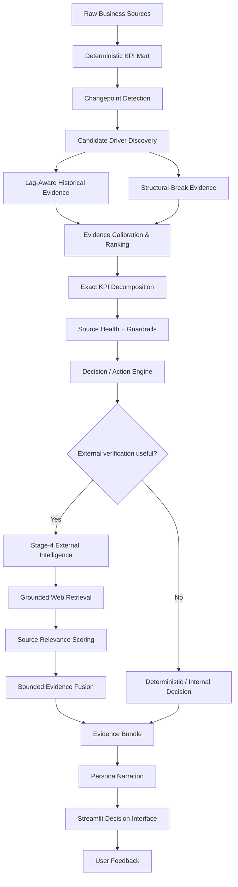
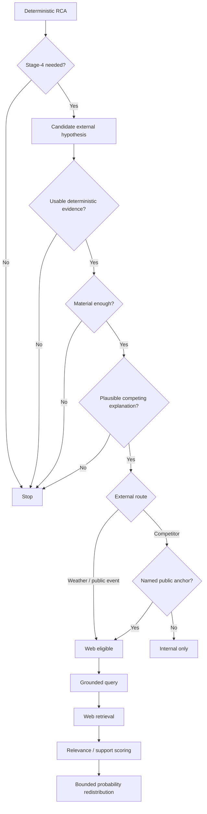

# Aletheia

> **Governed Decision Intelligence for Business KPI Root-Cause Analysis**

Aletheia is an explainable business decision-intelligence system that detects meaningful KPI shifts, decomposes those shifts into business components, evaluates plausible drivers using temporally safe statistical evidence, applies source-health and uncertainty guardrails, and selectively invokes external intelligence only when it can meaningfully discriminate between already-supported hypotheses.

The core design principle is simple:

> **LLMs and external retrieval may enrich interpretation, but they must never overwrite deterministic business evidence.**


Project repository and issue-tracker links should be added here immediately after
the GitHub repository is created.

## Table of contents

- [What problem does Aletheia solve?](#what-problem-does-aletheia-solve)
- [Architecture](#architecture)
- [Core analytical flow](#core-analytical-flow)
- [Analytical methodology](#1-kpi-contracts)
- [Benchmark](#benchmark)
- [Current validated development benchmark](#current-validated-development-benchmark)
- [Repository structure](#repository-structure)
- [Technology stack](#technology-stack)
- [Requirements](#requirements)
- [Installation](#installation)
- [Configuration](#configuration)
- [Generate benchmark data](#generate-benchmark-data)
- [Initialize MySQL](#initialize-mysql)
- [Run the pipeline](#run-the-pipeline)
- [Run evaluation](#run-evaluation)
- [Launch the application](#launch-the-application)
- [Feedback](#feedback)
- [Governance principles](#governance-principles)
- [Troubleshooting and FAQ](#troubleshooting-and-faq)
- [Development utilities](#development-utilities)
- [Status](#status)
- [Disclaimer](#disclaimer)

---

### What problem does Aletheia solve?

Traditional dashboards answer:

> **What changed?**

Aletheia is designed to go further:

> **Why did it change?**  
> **How confident are we?**  
> **What should the business investigate or do next?**

Example questions:

- Revenue declined — was the impact driven by lower average selling price or fewer units sold?
- Units fell — was stock availability the operational bottleneck?
- Churn increased — were support tickets the direct mechanism while uptime was the upstream trigger?
- A KPI changed during severe weather — is the external event actually supported by internal business evidence?
- A source became stale — should the system abstain rather than issue a business recommendation?

Aletheia turns these questions into a governed, auditable RCA pipeline.

---

## Architecture



---

## Core analytical flow

```mermaid
flowchart LR
    A[KPI Contract] --> B[Detect KPI shift]
    B --> C[Discover allowed drivers]
    C --> D[Select lag on historical-only data]
    D --> E[Evaluate incident activation]
    E --> F[Rank evidence]
    F --> G[Decompose KPI change]
    G --> H[Apply source-health guardrails]
    H --> I[Generate action state]
    I --> J[Optional Stage-4 retrieval]
    J --> K[Evidence bundle + narration]
```



---

## 1. KPI contracts

Business logic is declared in `config/kpi_contracts.yaml`.

Each KPI contract defines:

- KPI decomposition
- valid drivers
- maximum lag
- source cadence
- expected effect direction
- causal role
- mediator relationships
- component mapping

This prevents Aletheia from searching arbitrary correlations and forces analysis to remain business-ontology aware.

---

## 2. Changepoint detection

Aletheia identifies structural KPI shifts rather than treating every daily fluctuation as an incident.

Primary implementation: `src/signal_engine.py`

Changepoints act as the entry point for downstream RCA.

---

## 3. Driver discovery

For every detected KPI shift, Aletheia evaluates only drivers declared in the corresponding KPI contract.

Implementation: `src/driver_discovery.py`

Lag selection is performed on historical-only data to prevent temporal leakage. Future incident observations are never used to choose the lag.

---

## 4. Cadence-aware lag semantics

Not every source has daily information.

Typical source cadence:

```text
sales                 daily
marketing             daily
customer success      daily
market context        weekly
```

Aletheia therefore avoids false precision for coarse sources. A weekly source is interpreted at source-period resolution instead of being treated as an exact daily causal signal.

Example:

```text
Observed lag: 1 source period
Resolution: approximately 7 days
```

---

## 5. Evidence engine

Aletheia supports multiple deterministic evidence regimes.

### Historical relationship

Used when sufficient historical variation exists. Evidence considers historical coefficient, incident movement, coefficient stability, lag alignment, and expected business-effect direction.

### Structural break

Used when a driver has little historical variation but changes sharply during the incident. This prevents operational failures such as inventory availability collapsing from being discarded simply because the variable was historically stable.

### Insufficient evidence

When neither evidence regime is defensible, the system explicitly abstains.

Implementation: `src/evidence_engine.py`

---

## 6. Causal-chain semantics

Aletheia distinguishes between direct mechanism, upstream trigger, and mediator.


Interpretation:

```text
Platform uptime = upstream trigger
Support tickets = direct / actionable mechanism
```

This allows the system to explain the upstream trigger while keeping the operational action targeted at the nearer mechanism.

---

## 7. Exact KPI decomposition

Aletheia decomposes KPI changes before assigning driver explanations.

Example:

```text
Revenue = Units Sold × Average Selling Price
```

Revenue change is decomposed into unit effect, price effect, and interaction effect rather than being treated as an indivisible metric.

For ratio KPIs, exact symmetric decomposition is used instead of a first-order approximation.

Implementation: `src/decomposition_engine.py`

---

## 8. Source-health guardrails

Before issuing a business recommendation, Aletheia checks whether required source feeds were healthy at the time of the incident.

Checks include source availability, freshness, completeness, observed ingestion lag, and declared source status.

Example:

```text
Marketing source
Observed lag: 78 hours
Completeness: 0%
Status: stale
```

Result:

```text
Confidence -> Low
Business action -> blocked
```

This helps distinguish data-quality failures from genuine business shifts.

Implementation: `src/guardrails_engine.py`

---

## 9. Decision and action engine

Aletheia separates evidence confidence from action readiness.

Possible action states include:

```text
act
validate
validate_unexplained
monitor
data_quality_first
```

The system also separates the strongest analytical explanation from the most appropriate operational action target.

Implementation: `src/action_engine.py`

---

## 10. Stage-4 external intelligence

External retrieval is strictly downstream of deterministic RCA.

It cannot modify raw business data, KPI mart data, detected changepoints, selected lags, fitted coefficients, or deterministic evidence creation.

Stage 4 may only assess an already-existing externally resolvable hypothesis.



---

## 11. Retrieval precision

Being externally searchable does not automatically justify a web search.

A public hypothesis must have:

1. usable deterministic evidence;
2. plausible incident direction;
3. material within-component support;
4. meaningful absolute evidence;
5. another plausible competing hypothesis.

A conditional competitor hypothesis additionally requires a concrete public anchor such as a named competitor.

---

## 12. Bounded evidence fusion

External information may only redistribute probability mass among hypotheses that already exist.

If effective external support is zero:

```text
probability_after = probability_before
```

Retrieval therefore cannot manufacture evidence.

Implementation: `src/evidence_fusion.py`

---

## 13. Narration

The final evidence bundle is converted into business-readable narratives.

The narration layer is evidence-bounded. The LLM does not invent new drivers, new causal mechanisms, coefficients, evidence scores, or recommendations unsupported by the action layer.

Implementation: `src/narrator.py`

---

## Benchmark

Aletheia includes a reproducible semi-synthetic benchmark: **Aletheia Business RCA Benchmark v1.0**.

Business date range: `2024-01-01 -> 2025-02-28`

Regions:

```text
Mumbai
Bengaluru
Delhi
Chennai
Hyderabad
```

Products:

```text
aurora
nova
pulse
vertex
orbit_new
```

The benchmark includes scenarios covering:

| Scenario | Capability tested |
|---|---|
| Mumbai competitor pressure | commercial / pricing RCA |
| Bengaluru inventory shortage | operational supply RCA |
| Mumbai rainfall negative control | correlation != causation |
| Delhi churn cascade | lagged causal-chain reasoning |
| Hyderabad stale source | source-health guardrail |
| Diwali | expected seasonal event |
| Chennai severe-weather ambiguity | governed external retrieval |
| Orbit New | sparse-history behavior |
| Hyderabad control | false-positive behavior |

DEV and HOLDOUT use separate reproducible seeds:

```text
DEV     = 202610
HOLDOUT = 202611
```

Ground truth is generated only under benchmark outputs and must never be imported by production `src/*` code or `app.py`.

---

## Current validated development benchmark

| Metric | Result |
|---|---:|
| Changepoint Recall@1 | **100%** |
| Driver evidence coverage | **100%** |
| Top-1 driver accuracy | **100%** |
| Top-2 driver recall | **100%** |
| Mean Reciprocal Rank | **1.00** |
| Exact-lag accuracy on daily-identifiable cases | **100%** |
| Coarse-source cadence consistency | **100%** |
| Source-health detection recall | **100%** |
| Temporal-leakage violations | **0** |
| Decomposition failures | **0** |
| Action-language inconsistencies | **0** |
| Stage-4 policy failures | **0** |

Latest regression suite:

```text
44 tests
44 passed
```

These are development benchmark results, not general real-world accuracy guarantees.

---

## Repository structure

```text
aletheia/
|
|-- .streamlit/
|   `-- config.toml
|
|-- config/
|   |-- action_playbooks.yaml
|   |-- kpi_contracts.yaml
|   `-- retrieval_hypotheses.yaml
|
|-- data/
|   |-- generate_benchmark_data.py
|   |-- load_benchmark_into_mysql.py
|   `-- generated/                # local, reproducible, gitignored
|
|-- eval/
|   |-- validate_against_truth.py
|   |-- validate_action_language.py
|   |-- validate_stage4_policy.py
|   `-- test_*.py
|
|-- sql/
|   |-- 01_benchmark_schema.sql
|   |-- 02_benchmark_views.sql
|   |-- 03_analysis_schema.sql
|   |-- 04_operations_schema.sql
|   `-- 99_benchmark_verify.sql
|
|-- src/
|   |-- action_engine.py
|   |-- contracts.py
|   |-- database.py
|   |-- decomposition_engine.py
|   |-- driver_discovery.py
|   |-- evidence_engine.py
|   |-- evidence_fusion.py
|   |-- guardrails_engine.py
|   |-- narrator.py
|   |-- orchestrator.py
|   |-- pipeline.py
|   |-- repository.py
|   |-- retrieval.py
|   |-- signal_engine.py
|   |-- stationarity.py
|   `-- __init__.py
|
|-- app.py
|-- refresh_decision_language.py
|-- refresh_stage4_policy.py
|-- requirements.txt
|-- .env.example
|-- .gitignore
`-- README.md
```

---

## Technology stack

- **Runtime:** Python 3.11+, SQL, YAML
- **Storage:** MySQL 8+
- **Data / ML:** Pandas, NumPy, scikit-learn, statsmodels, SciPy, ruptures
- **LLM:** Ollama, default local model `llama3.1:8b`
- **External retrieval:** DDGS / DuckDuckGo, BeautifulSoup, requests
- **Interface:** Streamlit

---

## Requirements

Aletheia requires the following software and services:

- **Python 3.11+** — application runtime and analytical pipeline.
- **MySQL 8+** — raw, mart, analysis, feedback, and telemetry storage.
- **Ollama** — local LLM runtime used for narration and bounded Stage-4
  orchestration tasks.
- **`llama3.1:8b`** — default local development model.
- **Git** — source control and repository management.
- **Internet access for Stage 4** — required only when a policy-approved
  externally verifiable hypothesis is routed to web retrieval.

Python dependencies are declared in `requirements.txt` and installed with:

```bash
pip install -r requirements.txt
```

The deterministic RCA core remains usable without live web retrieval, but
LLM-dependent narration and Stage-4 orchestration require a running Ollama
instance.


## Installation

### 1. Clone

```bash
git clone <repository-url>
cd aletheia
```

### 2. Create a virtual environment

#### Windows PowerShell

```powershell
python -m venv .venv
.\.venv\Scripts\Activate.ps1
pip install -r requirements.txt
```

#### macOS / Linux

```bash
python3 -m venv .venv
source .venv/bin/activate
pip install -r requirements.txt
```

---

## Configuration

Aletheia is configured through environment variables and YAML contracts.

### Runtime configuration

Use `.env.example` as the reference for database and local-LLM settings.
The application reads credentials from environment variables rather than
hard-coding them in source files.

### KPI and decision configuration

- `config/kpi_contracts.yaml` defines KPI formulas, allowed drivers, lag limits,
  source cadence, effect direction, and causal-role metadata.
- `config/action_playbooks.yaml` defines evidence-bounded business action
  guidance.
- `config/retrieval_hypotheses.yaml` defines which hypotheses are internal,
  external, or conditionally external, together with grounded retrieval rules.

### Streamlit configuration

Application-level Streamlit settings are stored in:

```text
.streamlit/config.toml
```

Do not commit `.streamlit/secrets.toml` or local `.env` files.


## Environment variables

Use `.env.example` as reference.

Required variables:

```text
ALETHEIA_DB_HOST
ALETHEIA_DB_PORT
ALETHEIA_DB_USER
ALETHEIA_DB_PASSWORD
ALETHEIA_LLM_MODEL
OLLAMA_HOST
```

Example PowerShell session:

```powershell
$env:ALETHEIA_DB_HOST="127.0.0.1"
$env:ALETHEIA_DB_PORT="3306"
$env:ALETHEIA_DB_USER="root"
$env:ALETHEIA_DB_PASSWORD="your-password"
$env:ALETHEIA_LLM_MODEL="llama3.1:8b"
$env:OLLAMA_HOST="http://127.0.0.1:11434"
```

---

## Ollama setup

```bash
ollama pull llama3.1:8b
ollama list
```

---

## Generate benchmark data

Generate DEV:

```bash
python data/generate_benchmark_data.py --split dev
```

Generate both DEV and HOLDOUT:

```bash
python data/generate_benchmark_data.py --split both
```

Generated outputs are written under:

```text
data/generated/dev/
data/generated/holdout/
```

These files are reproducible and intentionally excluded from Git.

---

## Initialize MySQL

```bash
mysql -u root -p < sql/01_benchmark_schema.sql
mysql -u root -p < sql/02_benchmark_views.sql
mysql -u root -p < sql/03_analysis_schema.sql
mysql -u root -p < sql/04_operations_schema.sql
```

On Windows PowerShell:

```powershell
Get-Content .\sql_benchmark_schema.sql -Raw | mysql -u root -p
Get-Content .\sql_benchmark_views.sql -Raw | mysql -u root -p
Get-Content .\sql_analysis_schema.sql -Raw | mysql -u root -p
Get-Content .\sql_operations_schema.sql -Raw | mysql -u root -p
```

---

## Load benchmark data

```bash
python data/load_benchmark_into_mysql.py
```

---

## Run the pipeline

```bash
python -u -m src.pipeline
```

The full pipeline can take several minutes because narration and retrieval scoring use a local Ollama model.

---

## Run evaluation

```bash
python -m eval.validate_against_truth
python -m eval.validate_action_language
python -m eval.validate_stage4_policy
python -m unittest discover -s eval -p "test_*.py" -v
```

---

## Launch the application

```bash
streamlit run app.py
```

The UI provides:

- regional KPI overview
- KPI-level decision summaries
- exact decomposition
- driver evidence
- external-context audit
- source-health information
- action recommendations
- runtime telemetry
- user feedback

---

## Feedback

The current application records user feedback separately from analytical evidence in `app.user_feedback`.

The present design intentionally prevents raw user feedback from rewriting current RCA evidence.

A governed feedback-learning layer can use reviewed feedback to influence future pipeline decisions while preserving deterministic source facts and preventing self-reinforcing model behavior.

---

## Governance principles

### No benchmark leakage
Production code must never import benchmark scenario truth.

### No temporal leakage
Future incident observations may not be used to fit historical models or select lags.

### No retrieval contamination
External retrieval cannot modify `raw.*`, `mart.*`, detected changepoints, selected lags, or fitted model coefficients.

### No ungrounded causality
Statistical evidence is expressed as evidence or plausible explanation rather than definitive causal proof.

### Abstention is valid
When data quality or evidence quality is insufficient, Aletheia may return `monitor`, `validate`, or `data_quality_first` instead of manufacturing a confident recommendation.

---

## Troubleshooting and FAQ

### The Python tests fail outside the virtual environment

Activate the project environment first:

```powershell
.\.venv\Scripts\Activate.ps1
```

Then run:

```powershell
python -m unittest discover -s eval -p "test_*.py" -v
```

### MySQL connection fails

Confirm the following environment variables are set for the current shell:

```text
ALETHEIA_DB_HOST
ALETHEIA_DB_PORT
ALETHEIA_DB_USER
ALETHEIA_DB_PASSWORD
```

Also confirm that MySQL Server is running and that the benchmark schemas have
been created.

### Ollama calls fail

Check that Ollama is installed and the configured model is available:

```bash
ollama list
```

If needed:

```bash
ollama pull llama3.1:8b
```

### The full pipeline takes a long time

This is expected when local LLM inference is enabled. Deterministic RCA is
computed locally, while narration and eligible Stage-4 operations may invoke
Ollama. Downstream-only refresh helpers are available when deterministic RCA
has not changed.

### Stage 4 does not use the web for most incidents

That is intentional. Web retrieval is precision-gated and is only allowed when
an externally resolvable hypothesis is already supported, material, properly
grounded, and decision-relevant.

### Generated benchmark files are missing from Git

That is intentional. `data/generated/` is reproducible and gitignored. Recreate
it with:

```bash
python data/generate_benchmark_data.py --split both
```


## Development utilities

Refresh action / narration layer:

```bash
python refresh_decision_language.py
```

Refresh Stage-4 policy:

```bash
python refresh_stage4_policy.py
```

---

## Status

```text
RCA methodology: V4
Retrieval precision policy: V4.1
Regression suite: 44 / 44 passing
```

---

## Disclaimer

Aletheia is a decision-support prototype and benchmarked research system. Its outputs are intended to support human business judgment rather than replace domain experts, operational controls, or production governance processes.
